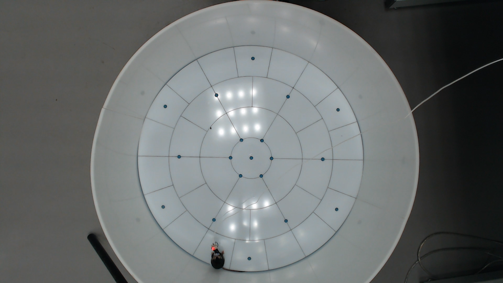

# Анализ поведения лабораторных мышей

Это приложение предоставляет веб-интерфейс для анализа видеэкспериментов над лабораторными мышами. Тип видеоэксперимента: open field (<<открытое поле>>). Входные данные должны выглядеть следующим образом:


## Возможности

- Обнаружение и отслеживание мыши с помощью YOLO
- Анализ и классификация поведения
- Отслеживание скорости и положения
- Зональный анализ (Центральная, Внутренняя, Средняя и Внешняя зоны)
- Автоматическая генерация графиков
- Выгрузка результатов (данные Excel/CSV и отладочное видео)

## Установка и запуск

### Запуск через Docker

Для запуска приложения через Docker:

1. Установите [Docker](https://docs.docker.com/get-docker/) и [Docker Compose](https://docs.docker.com/compose/install/)

2. Клонируйте репозиторий:
```bash
git clone https://github.com/Biomed-imaging-lab/AI-mouse-detector.git
cd MouseDetector
```

3. Соберите и запустите контейнер:
```bash
docker-compose up --build
```
><span style="color:red">**ВАЖНО**</span>: После выполнения данной команды на локальном компьютере (на котором запускается команда) будет создан docker-образ весом ~15Гб. Убедитесь в наличии свободного пространства на диске.

4. Откройте веб-браузер и перейдите по адресу:
```
http://localhost:8501
```

5. После завершения работы выполните команду:
```bash
docker-compose down
```
><span style="color:red">**ВАЖНО**</span>: Это остановит работу контейнера, но не удалит образ. При необходимости удалить образ выполните инструкции ниже.

Для удаления образа:
- Выполнить команду:
```bash
docker images
```
- Найти образ с названием `mousedetector-mouse-detector`
- Посмотреть его поле `IMAGE ID`
- Выполнить команду:
```bash
docker rmi <IMAGE ID>
```
где IMAGE ID – значение, указанное в столбце IMAGE ID для образа `mousedetector-mouse-detector`
#### Структура данных

При использовании Docker:
- Загруженные видео сохраняются в папке `uploads/`
- Результаты анализа сохраняются в папке `mouse_data/`
- Эти папки автоматически создаются при первом запуске

### Локальная установка (альтернативный способ)

Для выполнения локальной установки необходим установленный Python версии 3.11 и выше.

1. Клонируйте репозиторий:
```bash
git clone https://github.com/Biomed-imaging-lab/AI-mouse-detector.git
cd MouseDetector
```
2. Создайте виртуальное окружение:
```bash
python -m venv .venv
```
3. Активируйте виртуальное окружение в зависимости от операционной системы, на которой разворачивается проект (см. таблицу по ссылке): https://docs.python.org/3/library/venv.html#how-venvs-work 

4. Установите необходимые зависимости:
```bash
pip install -r requirements.txt
```
><span style="color:red">**ВАЖНО**</span>: После выполнения данной команды на локальном компьютере (на котором запускается команда) будут установлены необходимые библиотеки и пакеты обшим весом ~15Гб. Убедитесь в наличии свободного пространства на диске.
## Запуск приложения (для локальной установки)

1. Запустите приложение Streamlit:
```bash
streamlit run app.py
```

2. Откройте веб-браузер и перейдите по URL, указанному в терминале (обычно http://localhost:8501)

## Использование приложения

1. **Загрузка файлов**
   - Загрузите видеофайл (формат MP4 или AVI). Вид входных данных указан в начале README.

2. **Настройка анализа**
   - Выберите, нужно ли создавать отладочное видео
      - Отладочное видео – это исходное видео, на котором отображаются найденные зоны арены и ключевые точки мыши. Оно не перезаписывает старое видео, а создается вместе с ним. Может быть полезно для визуальной оценки работы алгоритма (находятся ли зоны арены или сама мышь).
   - Выберите, нужно ли создавать графики анализа
      - Графики анализа представляют из себя различные зависимости и карты, построенные на основе полученных данных. Полный список графиков анализа предоставлен ниже

3. **Запуск анализа**
   - Нажмите кнопку "Запуск" для начала обработки
   - Дождитесь завершения анализа
      - В зависимости от мощности машины, на которой ведется обработка, и размера видео анализ может занимать продолжительное время. В среднем для видеоролика длиной 5 минут анализ занимает 40-50 минут.
   ><span style="color:red">**ВАЖНО**</span>: Не обновляйте страницу после получения результатов, иначе в противном случае результаты не будут доступны для скачивания из интерфейса Streamlit. Результаты сохраняются локально в директорию проекта.

4. **Просмотр результатов**
   - Просмотр предварительных данных
   - Скачивание полных данных в формате Excel
   - Просмотр отладочного видео (если было создано)
   - Просмотр сгенерированных графиков (если были созданы)
   - Скачивание необходимых результатов

## Выходные файлы

Приложение генерирует несколько типов выходных файлов:

- Excel файл с подробными данными анализа
- Отладочное видео, показывающее обнаружение и отслеживание (опционально)
- Различные графики анализа:
  - Траектория движения мыши
  - График скорости во времени
  - Тепловая карта позиции
  - Тепловая карта скоростей
  - Гистограммы зонального анализа
  - Траектория мыши с указанием класса поведения в каждой точке

## Примечания

- Обработка больших видеофайлов может занять некоторое время
- Убедитесь, что у вас достаточно места на диске для выходных файлов
- При использовании Docker все данные сохраняются в локальных папках `uploads/` и `mouse_data/`
- Не останавливайте контейнер во время обработки видео
- При обновлении страницы в браузере текущие результаты анализа будут потеряны

# Analysis of the behavior of laboratory mice

This application provides a web interface for analyzing video experiments on laboratory mice. Type of video experiment: open field (<<open field>>). The input data should look like this:


## Features

- Mouse detection and tracking using YOLO
- Analysis and classification of behavior
- Speed and position tracking
- Zonal analysis (Central, Inner, Middle and Outer zones)
- Automatic graph generation
- Uploading results (Excel/CSV data and debugging video)

## Installation and launch

### Launch via Docker

To launch an application via Docker:

1. Install [Docker](https://docs.docker.com/get-docker /) and [Docker Compose](https://docs.docker.com/compose/install /)

2. Clone the repository:
``bash
git clone https://github.com/Biomed-imaging-lab/AI-mouse-detector.git
cd MouseDetector
```

3. Assemble and launch the container:
``bash
docker-compose up --build
``
><span style="color:red">**IMPORTANT**</span>: After executing this command, a docker image weighing ~15GB will be created on the local computer (on which the command is running).. Make sure that there is free disk space.

4. Open a web browser and navigate to:
``
http://localhost:8501
```

5. After completing the work, run the command:
``bash
docker-compose down
```
><span style="color:red">**IMPORTANT***</span>: This will stop the container from working, but it will not delete the image. If necessary, follow the instructions below to delete the image.

To delete an image:
- Run the command:
``bash
docker images
``
- Find an image named `mousedetector-mouse-detector`
- View its `IMAGE ID` field
- Execute the command:
``bash
docker rmi <IMAGE ID>
``
where IMAGE ID is the value specified in the IMAGE ID column for the `mousedetector-mouse-detector` image
#### Data structure

When using Docker:
- Uploaded videos are saved in the `uploads/` folder
- The analysis results are saved in the `mouse_data/` folder
- These folders are automatically created the first time you start

### Local installation (alternative method)

To perform a local installation, you need Python version 3.11 and higher installed.

1. Clone the repository:
``bash
git clone https://github.com/Biomed-imaging-lab/AI-mouse-detector.git
cd MouseDetector
```
2. Create a virtual environment:
``bash
python -m venv .venv
``
3. Activate the virtual environment depending on the operating system on which the project is deployed (see the table at the link): https://docs.python.org/3/library/venv.html#how-venvs-work 

4. Install the necessary dependencies:
```bash
pip install -r requirements.txt
```
><span style="color:red">**IMPORTANT**</span>: After executing this command, the necessary libraries and packages with a total weight of ~15 GB will be installed on the local computer (on which the command is running).. Make sure that there is free disk space.
## Launching the application (for local installation)

1. Launch the Streamlit app:
```bash
streamlit run app.py
```

2. Open a web browser and navigate to the URL specified in the terminal (usually http://localhost:8501 )

## Using the app

1. **File Upload**
   - Upload a video file (MP4 or AVI format). The type of input data is specified at the beginning of the README.

2. **Analysis Settings**
- Select whether you want to create a debugging video
      - The debugging video is the source video that displays the found areas of the arena and the mouse key points. It does not overwrite the old video, but is created with it. It can be useful for visual evaluation of the algorithm (whether there are areas of the arena or the mouse itself).
   - Select whether you want to create analysis graphs
      - The analysis graphs represent various dependencies and maps based on the data obtained. The full list of analysis graphs is provided below.

3. **Starting the analysis**
- Click the "Start" button to start processing
   - Wait for the analysis to be completed
      - Depending on the power of the processing machine and the size of the video, the analysis may take a long time. On average, for a 5-minute video, the analysis takes 40-50 minutes.
   ><span style="color:red">**IMPORTANT**</span>: Do not refresh the page after receiving the results, otherwise the results will not be available for download from the Streamlit interface.e. The results are saved locally to the project directory.

4. **Viewing the results**
   - Viewing preliminary data
   - Download complete data in Excel format
   - View debugging video (if created)
- View generated graphs (if created)
   - Download the necessary results

## Output files

The application generates several types of output files:

- Excel file with detailed analysis data
- Debugging video showing detection and tracking (optional)
- Various analysis graphs:
- Trajectory of mouse movement
- Graph of speed over time
  - Heat map of position
- Heat map of velocities
  - Histograms of zonal analysis
  - The trajectory of the mouse indicating the class of behavior at each point

## Notes

- Processing of large video files may take some time.
- Make sure you have enough disk space for the output files.
- When using Docker, all data is saved in the local folders `uploads/` and `mouse_data/`
- Do not stop the container while processing the video
- When updating the page in the browser, the current analysis results will be lost
